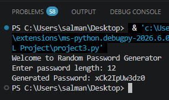

# Python Random Password Generator

A simple command-line Random Password Generator built using Python. This project generates secure and random passwords based on the length entered by the user.

## Features

- Generate random passwords
- User chooses the password length
- Uses uppercase letters, lowercase letters, and numbers
- Simple command-line interface

## Technologies Used

- Python 3

## Python Modules Used

- random
- string

## How to Run

1. Download or clone this repository.
2. Open the project folder in VS Code.
3. Run the following command:

```bash
python project3.py
```

## Screenshot



## Example

```text
Welcome to Random Password Generator

Enter password length: 8

Generated Password: A7kP2mX9
```

## What I Learned

- Importing modules
- Using `random`
- Using `string`
- For loops
- String manipulation
- User input
- Random character generation

## Author

Khadeeja Aqeel

Created as part of my Python learning journey.
